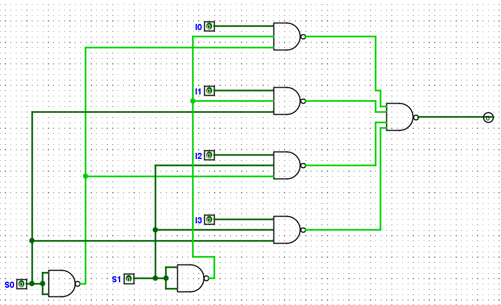
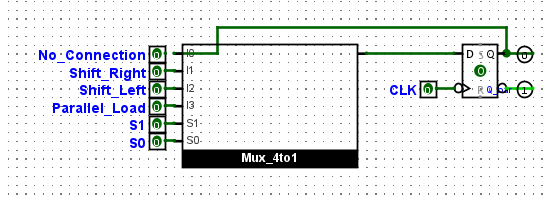
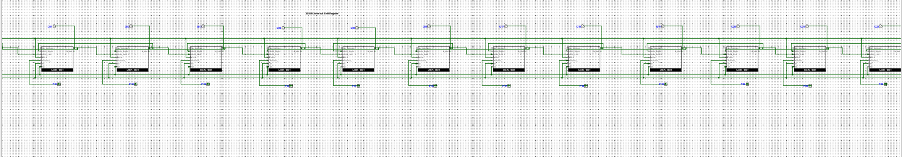
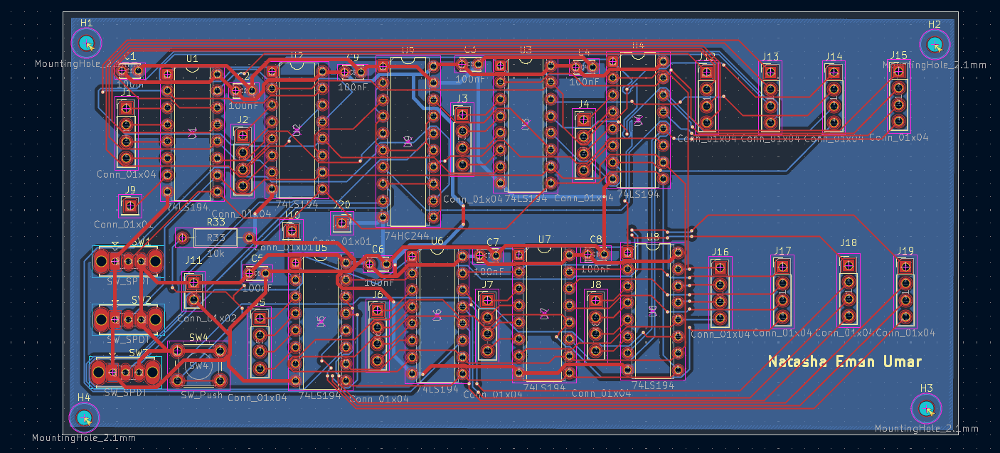
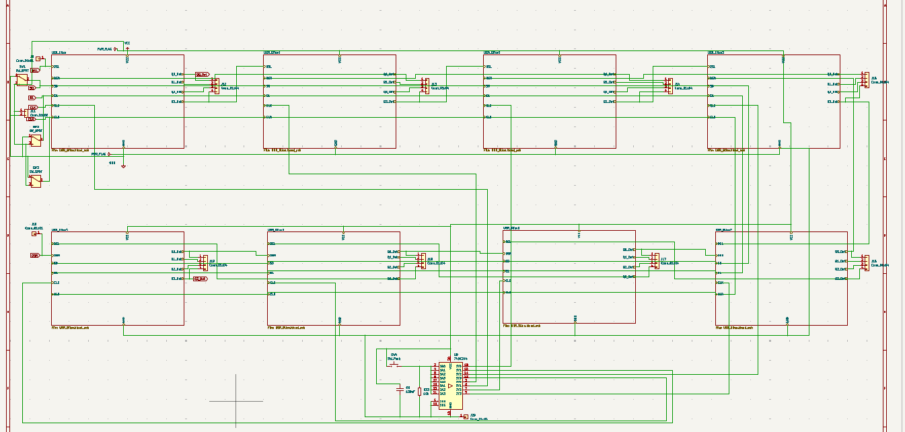
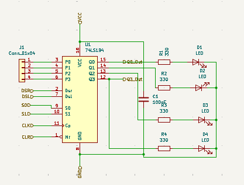
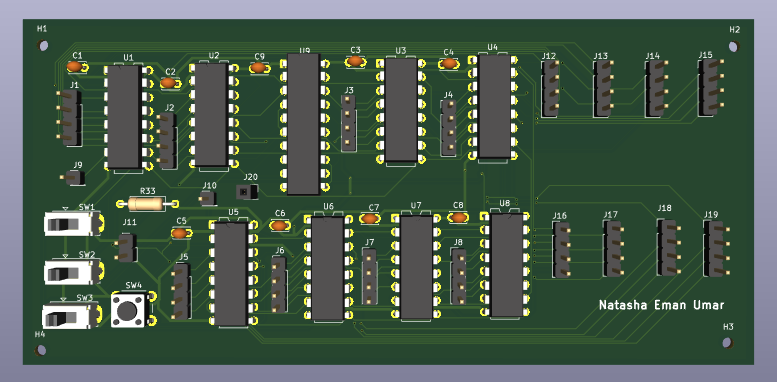
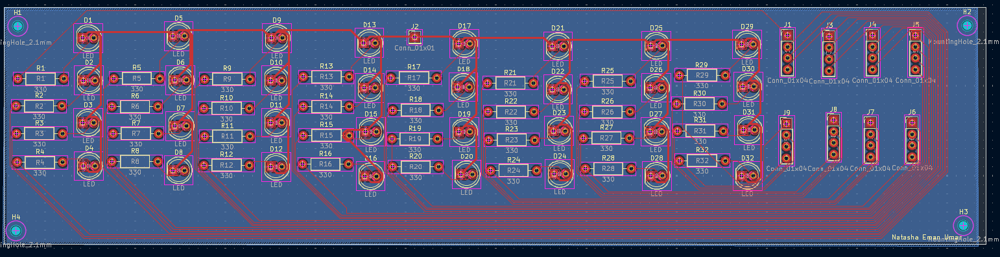
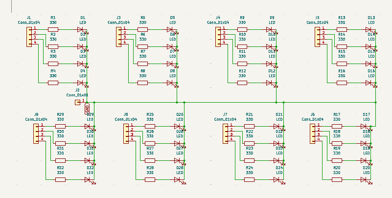
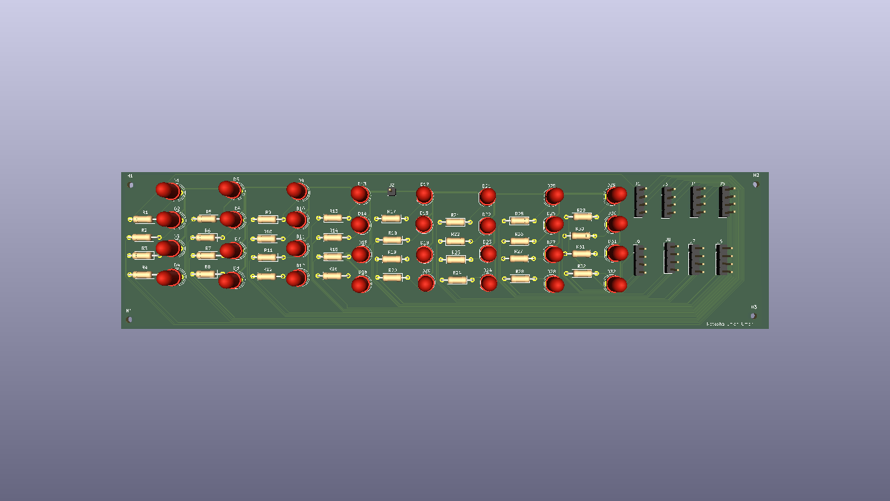

# Modular 32-bit Universal Shift Register


## Repository Contents

- 📄 Documentation
- 🖥️ Logisim Designs
- 📐 KiCad Schematics
- 🛠 PCB Layouts
- 📦 Gerber Files
- 🎨 3D PCB Models

## Table of Contents

- [Overview](#overview)
- [Key Features](#key-features)
- [Project Development](#project-development)
- [Design Decisions](#design-decisions)
- [Project Structure](#project-structure)
- [Software & Tools Used](#software--tools-used)
- [Design Files](#design-files)
- [Future Improvements](#future-improvements)
- [License](#license)
- [Author](#author)

## Overview

This project presents the design and implementation of a **modular 32-bit Universal Shift Register (USR)**, developed as a personal learning project during my BS Electrical Engineering studies.

The project began with digital logic design in **Logisim Evolution**, where the complete Universal Shift Register was designed and verified from the gate level. After validating the logic, the design was implemented in **KiCad** as a modular hardware system consisting of two printed circuit boards:

- **Main Logic Board** – Implements the core Universal Shift Register logic.
- **Interface Board** – Provides LEDs, current-limiting resistors, and headers for visualization and user interaction.

The modular architecture improves maintainability, simplifies debugging, and allows the logic board to be reused independently of the user interface.

The repository contains the complete design process, including digital logic, schematics, PCB layouts, 3D models, manufacturing files, and project documentation.

## Key Features
- Modular 32-bit Universal Shift Register architecture
- Custom digital logic designed and verified in Logisim Evolution
- Two-board PCB architecture developed in KiCad
- Main Logic Board and separate Interface Board
- Complete schematic capture and PCB layout
- Design Rule Check (DRC) completed with zero errors
- Manufacturing-ready Gerber and Drill files
- 3D PCB visualization
- Modular design for easier debugging and future expansion

# Project Specifications

| Item | Description |
|------|-------------|
| Register Width | 32-bit |
| Core Logic IC | 74LS194 Universal Shift Register |
| PCB Design Software | KiCad |
| Logic Design Software | Logisim Evolution |
| Architecture | Modular Two-Board Design |
| DRC Status | Passed (0 Errors) |
| Manufacturing Files | Included |

The project was developed incrementally, beginning with digital logic verification before progressing to PCB implementation and manufacturing-ready outputs.

## Project Development

## Digital Logic Design (Logisim Evolution)

The following figures illustrate the progression of the project from digital logic design to PCB implementation.

| 4:1 Multiplexer | 1-bit Universal Shift Register |
|-----------------|-------------------------------|
|  |  |

*Figure 1. Custom multiplexer (left) and 1-bit Universal Shift Register (right).*

<br>

| Complete 32-bit Universal Shift Register |
|------------------------------------------|
|  |

*Figure 2. Complete 32-bit Universal Shift Register verified in Logisim Evolution.*

## Hardware Implementation (KiCad)

### Main Logic Board

| PCB Layout | Schematic |
|------------|-----------|
|  |  |

*Figure 4. PCB Layout (left) and Schematic (right) of the Main Logic Board.*

<br>

| Modular Slice PCB | 3D View |
|-------------------|---------|
|  |  |

*Figure 5. Modular PCB slice (left) and 3D rendering (right) of the Main Logic Board.*

### Interface Board

| PCB Layout | Schematic |
|------------|-----------|
|  |  |

*Figure 6. PCB Layout (left) and Schematic (right) of the Interface Board.*

<br>

| 3D View |
|----------|
|  |

*Figure 7. 3D rendering of the Interface Board.*


## Design Decisions

Several engineering decisions were made during the development of this project to improve modularity, maintainability, and ease of debugging.

### Modular Hardware Architecture

Rather than combining the complete system onto a single PCB, the design was divided into two independent boards:

- **Main Logic Board** – Implements the Universal Shift Register logic.
- **Interface Board** – Contains LEDs, current-limiting resistors, and user interface headers.

Separating the interface circuitry from the logic circuitry results in a cleaner PCB layout, simplifies routing, and allows the logic board to be reused with different interface modules.

### Engineering Workflow

Instead of designing the hardware directly, the project followed a structured engineering workflow:

1. Design and verify the logic in Logisim Evolution.
2. Validate the complete 32-bit architecture.
3. Design the hardware implementation in KiCad.
4. Perform PCB Design Rule Checking (DRC).
5. Generate manufacturing-ready Gerber and Drill files.

This workflow reduced design errors before hardware implementation and provided confidence in the final PCB design.

## Project Structure

```

32-bit-Universal-Shift-Register
├── Datasheets/
├── Gerber/
│   ├── Logic_Board/
│   └── Interface_Board/
├── Images/
├── KiCad/
│   ├── Logic Board/
│   └── Interface Board/
├── Logisim/
├── README.md
└── LICENSE

## Software & Tools Used

| Software | Purpose |
|----------|---------|
| Logisim Evolution | Digital logic design and verification |
| KiCad | Schematic capture, PCB layout, and 3D visualization |
| Git | Version control |
| GitHub | Project hosting and documentation |

## Design Files

The repository includes all files required to study, modify, or manufacture the project:

- Logisim Evolution project files
- KiCad schematic files
- KiCad PCB layout files
- 3D PCB models
- Manufacturing-ready Gerber files
- Drill files
- Images and documentation

## Future Improvements

Possible future enhancements include:

- Hardware testing using fabricated PCBs
- Functional verification of the complete 32-bit hardware
- Integration with FPGA or microcontroller-based systems
- Expansion into larger modular register architectures

## License

This project is released under the MIT License.

## Author

**Natasha Eman**

BS Electrical Engineering Student
FAST National University of Computer and Emerging Sciences (FAST-NUCES)


GitHub: https://github.com/Natasha-Eman

<<<<<<< HEAD
### Technologies & Tools

- KiCad
- Logisim Evolution
- Python
- OpenCV
- Git & GitHub

---

This project represents my journey from digital logic simulation to PCB implementation, with the goal of strengthening my understanding of practical hardware design and engineering workflows.

I welcome constructive feedback and suggestions for improving both the design and the documentation.
=======
LinkedIn: https://www.linkedin.com/in/natasha-eman-368531329
>>>>>>> ecc2cd1 (Refactor project into modular two-board architecture and update documentation)
